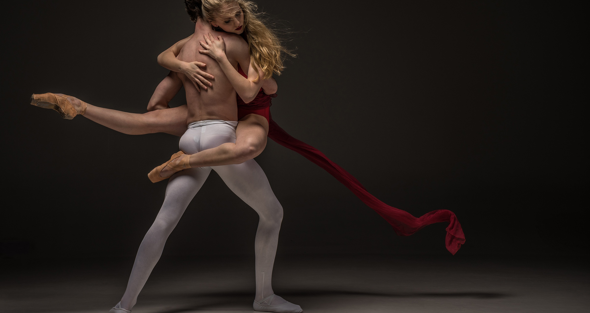

The Bolshoi is a repertory theatre, meaning that it draws from a list of productions, any one of which may be performed on a given evening. It normally introduces two to four new ballet or opera productions each season and puts a similar number on hold. The sets and costumes for most productions are made in the Bolshoi's own workshops.
<!--  -->
The performers are drawn primarily from the Bolshoi's regular ballet and opera companies, with occasional guest performances. Since the dissolution of the Soviet Union, there have been a few attempts to reduce the theatre's traditional dependence on large state subsidies. Corporate sponsorship occurs for some productions, but state funding is still the lifeblood of the company.
